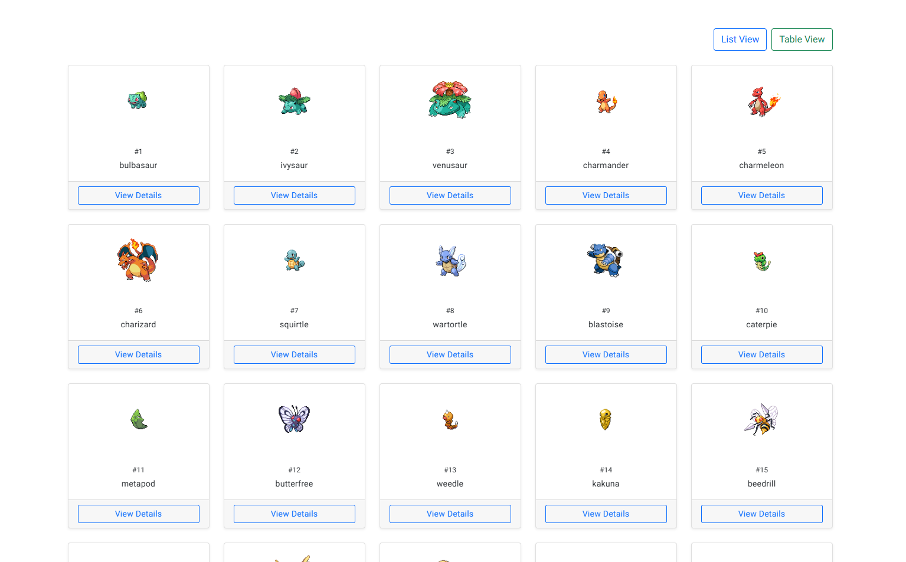

<h1 align="center"><b>Hi , I'm Xavi Serrano </b></h1>

 

<picture> </picture>
	
- Graduate in business management
- Specialized in Data Analysis and Literacy
- Passionate Self-Taught Full-Stack Developer
- Currently Pursuing an Online Master's in Web Development
- I am actively seeking an internship or new job opportunity. Here is my [my resume](https://drive.google.com/file/d/18dRKflXlkYl5Hl9FT49ajKbKtd9VKuSw/view?usp=drive_link)

 

## <b> Skills </b>
 

 

   
   
   
   
   
   
   
   
   
   
   
   
   
   
   
   
   
   
      
 

 

## <b> Projects </b>
 

<table>
  <tr>
    <td align="center">
       
      <strong>PokeAPI PWA</strong> 
      
      
        
      <strong>Tecnologias</strong> 
      
      
    </td>
  </tr> 
</table>

## <b> Github Stats </b>
 

 
 
 

## <b> Let's Connect!</b>
 

<ul style="list-style-type: none;">

 

	
</ul>

